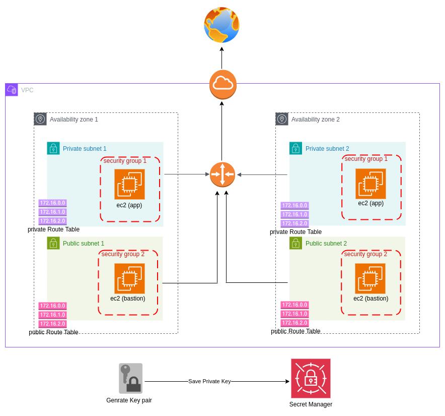

## Terraform Bastion Host for AWS
This Terraform project creates a Bastion host in AWS to provide secure access to servers within a private network. It creates an EC2 instance in a public subnet and configures it as a Bastion host. It also creates a security group to allow SSH access to the Bastion host from the public internet.

## aws architecture
